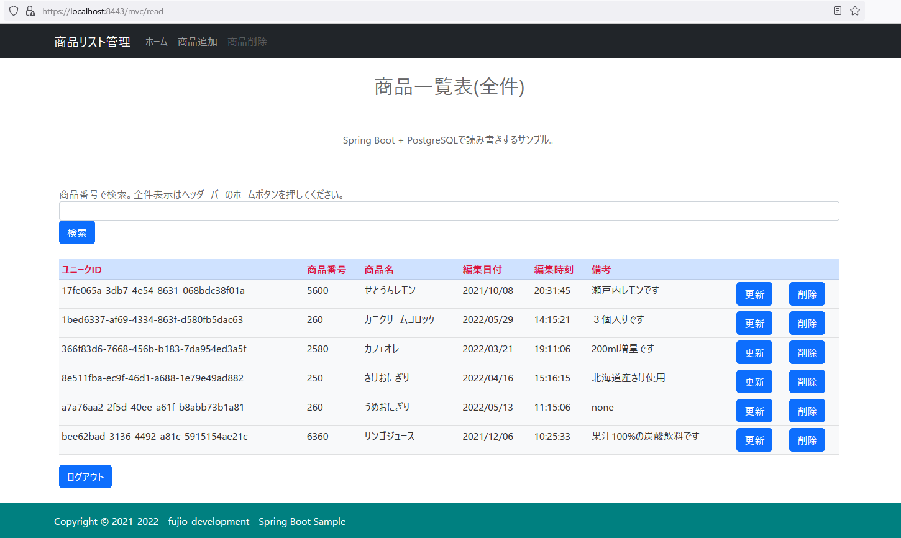
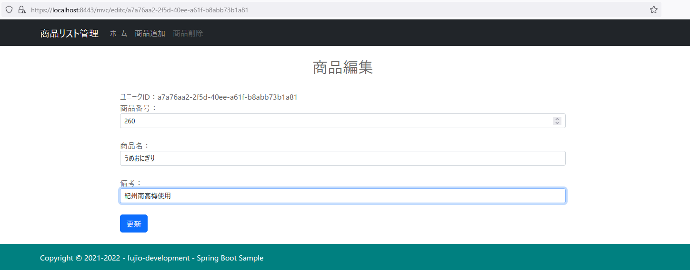
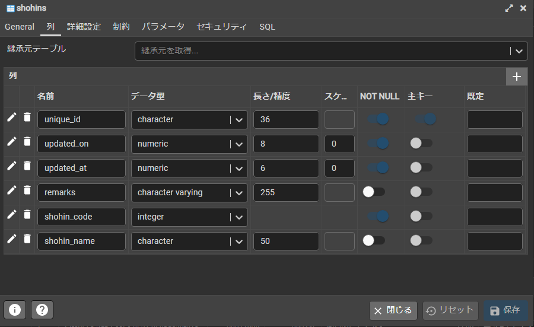

## :leaves: SpringBootでJPA(O/Rマッピング)を使いPostgreSQLとの読み書きサンプル

## 1. 開発環境  
```
統合開発環境：Eclipse 2022-12 R(4.26.0) Pleiades + Spring Tool Suite プラグイン 4.17.0
プログラム言語：Java 17  
開発SDK：Oracle JDK 17.0.5  
フレームワーク：Spring Boot 3.0.0  
-Spring Framework 6.0.2  
-サーブレットエンジン：Apache Tomcat ${tomcatVersion}  
-テンプレートエンジン：Thymeleaf 3.1.0  
-データベース接続：PostgreSQL JDBC 4.2 Driver 42..1  
-O/R マッピング フレームワーク：Hibernate ORM 6.1.5.Final + JPA 2.2  
-ログイン認証:Spring Security 6.0.0
ログイン認証：Form認証(MVC用)、Basic認証(WebAPI用) 兼用
データベース：PostgreSQL 15.1
-データベース管理ツール：pgAdmin 6.16
ビルドツール： Gradle 7.6 Groovy
CSSテンプレート：Bootstrap 5.2.3
```

<br />

### 改良移行中。
1. Spring Security 6.0で非推奨となったクラスライブラリのコンフィグ系を推奨クラスに移行。  
2. ログインユーザーをデータベースから検索し比較するメソッドとテスト用のインメモリーにユーザーを持って比較するプログラム追加。  
3. ビルドツールをMavenからGradle(Groovy)に移行。  
4. O/RマッピングをJava Persistence APIからJakarta Persistence APIに移行  
5. 設定ファイルをプロパティファイルからymlファイルに移行。  
データリソース用のデータベースが変わっても設定ファイルを切り替えるだけで別のデータソースへ切り替わるようyml編集。  

<br />

## 2. 事前準備  
### サンプルプログラムを実行する際のデータベース作成  
PostgreSQLのクエリーやpgAdminのクエリーツールで以下のSQLを実行するかこれ相当をpgAdminなどの管理ツールのデータベース作成で作成します。  

#### データベース作成(pgAdminでのデフォルト相当)  
データベース名は`SpringBootPostgres`です。  

```
-- Database: SpringBootPostgres

-- DROP DATABASE IF EXISTS "SpringBootPostgres";

CREATE DATABASE "SpringBootPostgres"
    WITH 
    OWNER = postgres
    ENCODING = 'UTF8'
    LC_COLLATE = 'Japanese_Japan.932'
    LC_CTYPE = 'Japanese_Japan.932'
    TABLESPACE = pg_default
    CONNECTION LIMIT = -1;
````

#### テーブル作成およびサンプルデータ  
SpringJpaの機能および設定によりテーブルが無ければ作成しますので必要ありません。  
サンプルデータもデータが１件も無ければプログラムにより作成する様になっていますので必要ありません。  


<br />

## 3. 実行イメージ  
#### 画面・イメージ／一覧  
  

#### 画面・イメージ／更新  
  

#### 画面・イメージ／例外  


#### 画面・イメージ／ページなし  


#### データベース管理ツール・イメージ／テーブル  
  
  